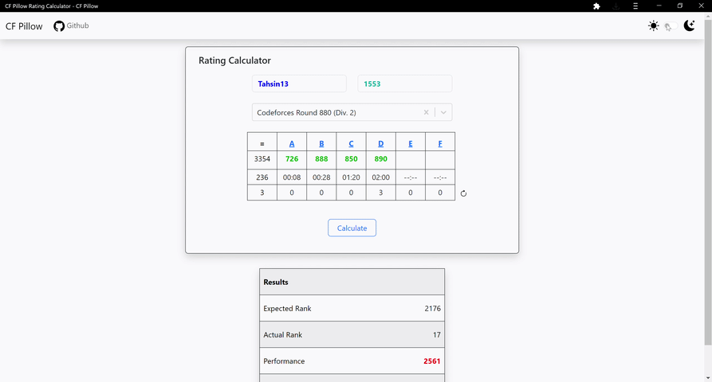
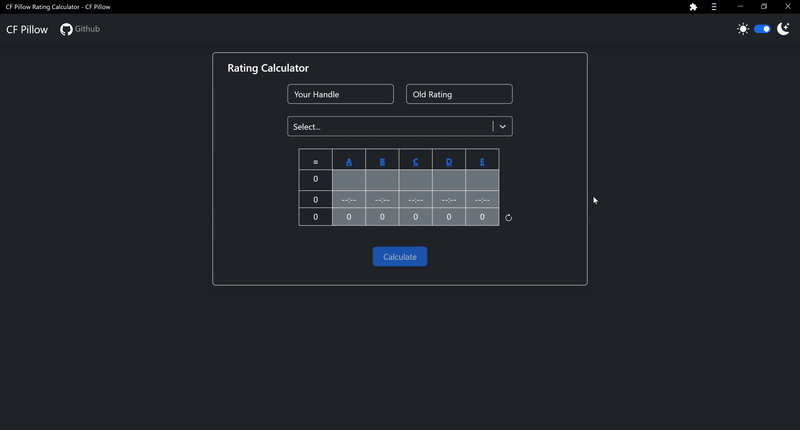
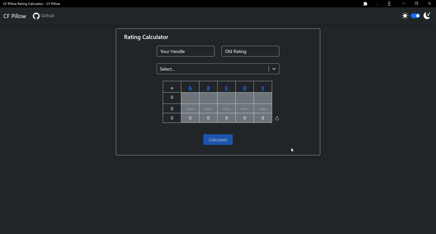
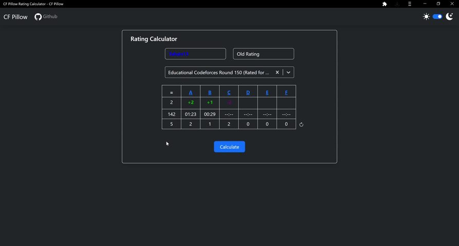

# CF Pillow (https://tahsinahmed13.github.io/cf-pillow/)

## About

Yet another Codeforces rating calculator! Want to know what your delta would've been if you had done slightly better? Put your worries to sleep without having to worry about contest rules or calculating points and penalties by hand. 

I created this rating calculator because [cfviz](https://cfviz.netlify.app/virtual-rating-change.html), the de facto Codeforces rating calculator didn't have some features that I wanted, mainly a [scoreboard](#interactive-scoreboard) to edit solve times and penalities without having to worry about ICPC vs. CF rulesets and a way to easily [search](#fuzzy-contest-search) for contests. 

Rating calculation was done using the formulae in this [blog](https://codeforces.com/blog/entry/20762) by Mike Mirzayanov. Compared to cfviz, you might get different results for [Educational Rounds](https://codeforces.com/blog/entry/21496). This is because these contests are only rated for Div. 2 participants, Div. 1 participants count as official participants. Cfviz, as far as I am aware, does not filter out these contestants. In practice I have found the results to be closer to the actual Codeforces deltas.

## Features

### Themes

Seamlessly switch between light mode and dark mode. 

<p align="center">
  
</p>

### "Fuzzy" Contest Search

Search for contests by name without having to look for their ids. Many thanks to [junegunn](https://github.com/junegunn) for creating [fzf](https://github.com/junegunn/fzf) and [ajit](https://github.com/ajitid) for creating a [javascript port](https://github.com/ajitid/fzf-for-js) of it. 

<p align="center">
  
</p>

### Interactive Scoreboard

Edit problem scores and penalities for both ICPC and CF styled contests without having to worry about all the rules. 

<p align="center">
  
</p>

### Submissions

View your submissions to problems directly without having to go back to Codeforces. 

<p align="center">
  
</p>

## Build 

This project was built with [create-react-app](https://create-react-app.dev/). If the site is ever down, you can run it locally. 

```
git clone https://github.com/TahsinAhmed13/cf-pillow.git
cd cf-pillow
npm start
```

## Tech Stack and Libraries

* [React](https://react.dev/)
* [create-react-app](https://create-react-app.dev/)
* [React Bootstrap](https://react-bootstrap.netlify.app/)
* [React Select](https://react-select.com/home)
* [Fzf](https://github.com/ajitid/fzf-for-js)

## Credits

* Mike Mirzayanov for creating Codeforces
* Cfviz for inspiring this project
* [Pillow icons created by Freepik - Flaticon](https://github.com/ajitid/fzf-for-js) for the favicon